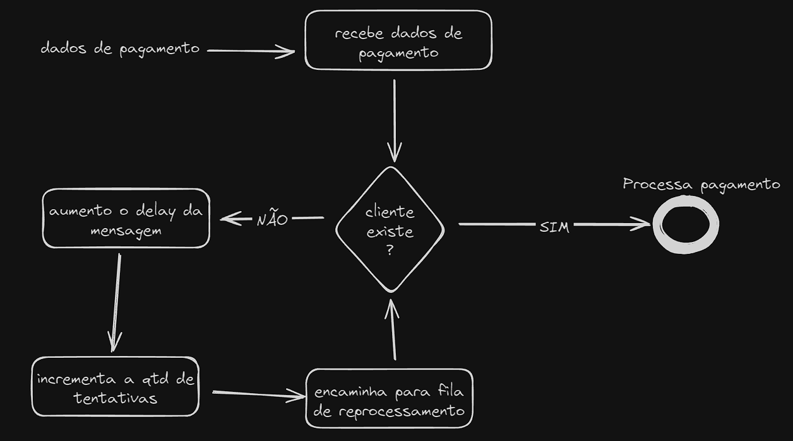
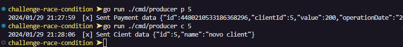
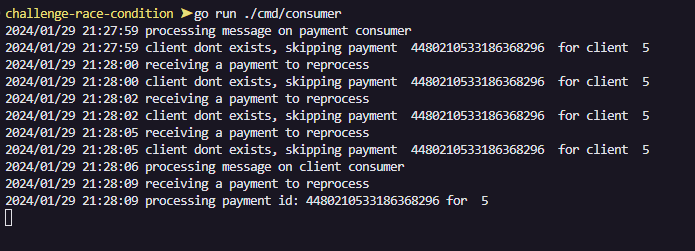

# Desafio de race condition em sistemas distribuidos

Esse pequeno projeto, foi baseado em um desafio lançado pelo [Zan](https://twitter.com/zanfranceschi) la nessa [thread](https://twitter.com/zanfranceschi/status/1743040590751977636) do twitter, a ideia é bem simples:

- temos um serviço de pagamentos que consome dados de duas filas:
  - fila com dados de clientes para cadastrar
  - fila com dados de um pagamento para ser processado
- esse serviço processa os pagamentos, porém ele só processa pagamentos de clientes cadastrados

O desafio proposto foi, como tratar o problema de race condition quando um evento de pagamento é recebido primeiro que o evento de cadastro de clientes (sem utilizar bancos de dados). Para simplificar mais temos a premissa que o evento de cadastro de cliente sempre será recebido.

## A solução:
- uma fila para evento de cadastro de clientes
- uma fila para evento de pagamentos
- uma fila para reprocessar eventos de pagamentos utilizando o plugin `delayed_message_exchange` do rabbitmq

Quando um evento de pagamento é recebido e o cliente ainda não existe, incrementamos em 1s o valor de delay da mensagem e encaminhamos para a fila de reprocessamento, em algum momento, quando um cliente for criado o pagametno será processado. 

Em um fluxo grama bem simples teriamos algo como: 

## Como executar:
O docker-compose executa o rabbitmq carregando os arquivos de plugins existentes na pasta `rabbitmq` na raiz do projeto. 

Execute `go run ./cmd/consumer` para executar os processadores para as filas de Cliente, Pagamento e Reprocessar pagamento

Agora, para publicar mensagens, você pode:

- Executar `go run ./cmd/producer p :id` para publicar uma mensagem de pagamento para o cliente com id :id

- Executar `go run ./cmd/producer c :id` para publicar uma mensagem de cadastro para o cliente com id :id
 
### Exemplo 
Para o exemplo, vamos enviar duas mensagens, uma com o pagamento e outra com o novo cliente

Na visão do consumer teremos algo dessa forma:

 

Ao receber um pagamento de um cliente com o ID 5, o pagamento não vai ser processado, a mensagem é enviada para uma fila e o delay vai aumentando, até que a mensagem de cadastro do cliente é recebida, no proximo recebimento do pagamento ele será processado e a operação finaliza

